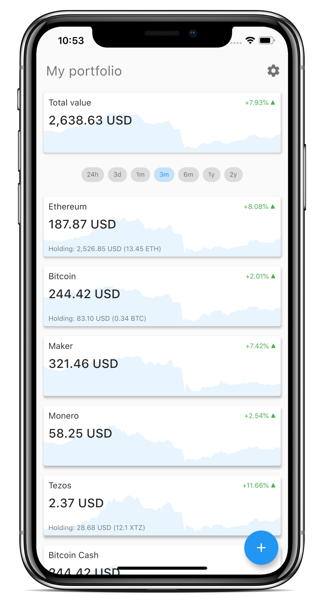
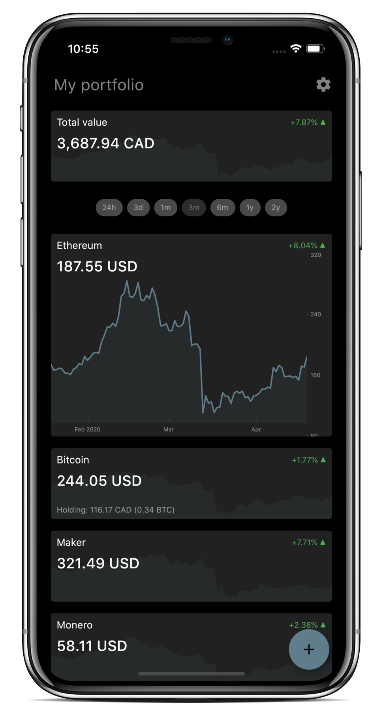

With your portfolio, keep an eye on your crypto prices and holdings value, in a beautiful and minimalistic application.

## Features

- Keep eye on all your cryptoassets prices, and the value of your holdings in your portfolio.
- Enter each cryptocurrency you want, whether you own some of it or just want to keep an eye on its price.
- Watch the value of all your assets individually or the total value of your portfolio.
- Display charts of crypto prices or your holdings’ value.
- See the prices in a currency and your portfolio value in another.

### In the future…

- Synchronize across several devices by creating an account.
- Display other information, such as market cap or daily trading volumes.

## Technical stack & credits

- The application is built with [Flutter](https://flutter.dev/).
- Data is provided by [CoinGecko](https://www.coingecko.com/).
- App logo was created from an image from [Vecteezy](https://www.vecteezy.com/).

## Contribute

Feel free to request features or report bugs by [submitting an issue](https://gitlab.com/scastiel/portfolio-app/issues) or even pull-requests if you want to contribute in any way 😊.

## Licence

Published under the GNU GPL v3 (see [LICENSE](https://github.com/scastiel/portfolio-app/blob/master/LICENSE)).
